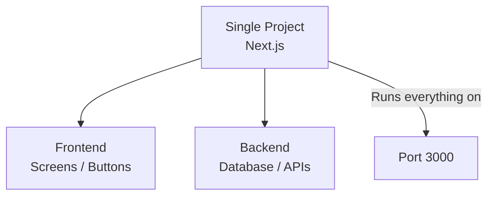
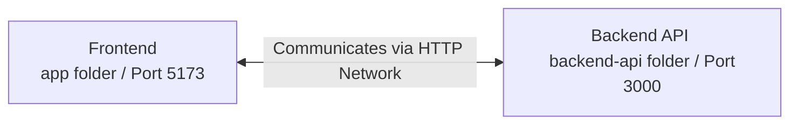

# 🏛️ Software Architecture Guide for QA: Monolith vs Split Folders

Welcome to your **Software Architecture** guide for QAs! Here, we explain in simple, visual terms why your projects are structured differently and how this applies in the real-world tech industry.

---

## 🍕 1. What is Software Architecture?

Software architecture is the way developers organize files, folders, and servers in a system. 

In your portfolio, you have two completely different architectural models. This is excellent because it proves to recruiters that you understand both paradigms!

---

## 🧱 Model A: Unified Structure (Monolith)
*Example in your portfolio: **Pet Bath Scheduler***

In the Pet Bath project, Next.js manages **everything together** (Frontend screens + Backend APIs) in the same codebase, running on the same port (`localhost:3000`).

### 📌 Key Features:
*   **Single Command:** A single `npm run dev` starts the entire system.
*   **Pros:** Simpler to develop, extremely fast to deploy, and excellent for small teams.
*   **Where it's used:** Startups, MVP development, small-to-medium systems, or quick prototypes.

---

## 🥗 Model B: Split Structure (Client-Server / Microservices)
*Example in your portfolio: **My Pizza Register** (SauceDemo / Pizza)*

In the Pizza project, everything is **completely separated** into two independent folders:
1.  📁 **`app/` (The Frontend):** Runs on port `localhost:5173` (Vite) managing the user interface.
2.  📁 **`backend-api/` (The Backend):** Runs on port `localhost:3000` (Node.js/Express) managing database records.

### 📌 Key Features:
*   **Separate Terminals:** You must run `cd app` and `npm run dev` in one terminal, and `cd backend-api` and `node server.js` in another terminal.
*   **Pros:** Highly modular. If the frontend UI crashes, the database backend remains perfectly safe.
*   **Where it's used:** **The absolute standard for medium-to-large companies!**

---

## 💼 Why do companies prefer separate structures?

In real-world corporate environments, separate structures dominate because:

1.  **Team Isolation:** Frontend developers work on `app/` and Backend developers work on `backend-api/` without steping on each other's code.
2.  **Tech Diversity:** The frontend can be built in React (JavaScript) while the backend is written in Java, C#, or Python.
3.  **Scale:** If the website gets millions of hits, the company can scale up the frontend servers without paying to multiply the database server.

---

## 🎯 Impact on QA Test Strategy

Understanding this architecture defines how you test:

| What do you want to test? | Where do you point your test? | Recommended Tools |
|---|---|---|
| **Screens & User Flows (E2E)** | Frontend port (`localhost:5173`) | Playwright / Cypress / Selenium |
| **Data & Core Logic (APIs)** | Backend port (`localhost:3000`) | Postman / Thunder Client / K6 |

Now you know exactly what to say when a recruiter asks: *"Have you ever worked with separated Frontend and Backend services?"* 😉🎓🚀

---

## 🚨 BONUS: What is Regression Testing?

If a recruiter asks: *"Priscila, what is a Regression Test?"*, here is your golden answer:

> **"Regression Testing is the practice of running all existing test cases after a code change or bug fix. The goal is to guarantee that the new changes have not broken any feature that was already working."**

### 🚗 The Car Analogy
Imagine taking your car to the mechanic because the **radio** is broken. The mechanic fixes the radio, but as you drive away, you realize the **headlights** are no longer turning on! The fix broke something else! 

A **Regression Test** is like checking the headlights, brakes, and doors after fixing the radio to ensure everything else is still working.

### 🤖 Why is Automation essential for Regression?
Manually clicking through hundreds of screens for every code update is exhausting. With our Playwright automation, we run the entire regression suite in **11 seconds**, ensuring high quality before deployment!
